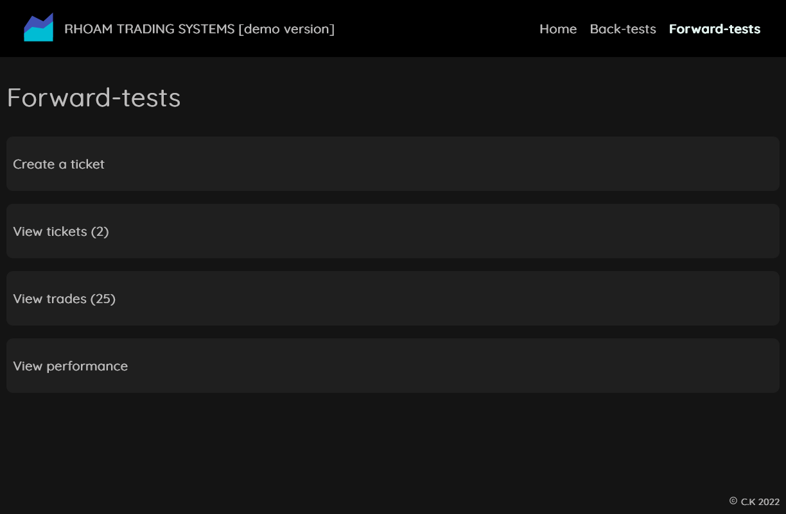
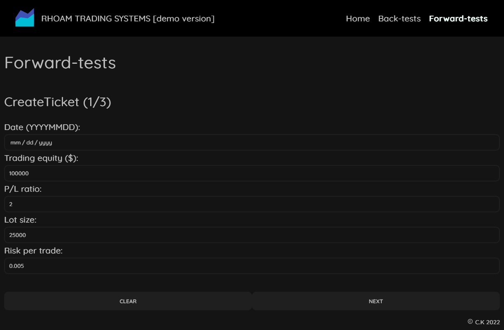
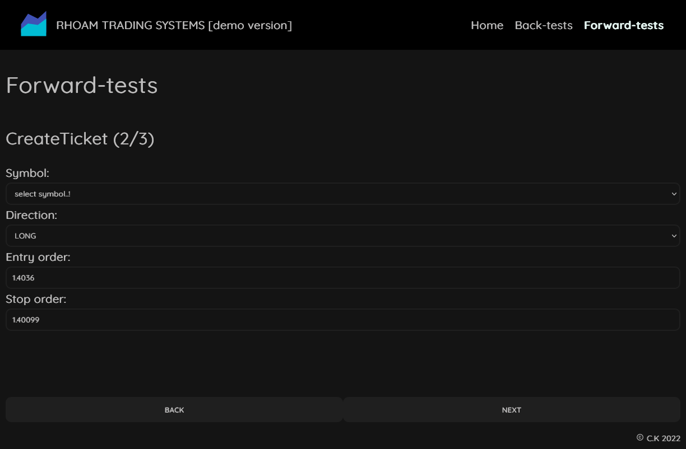
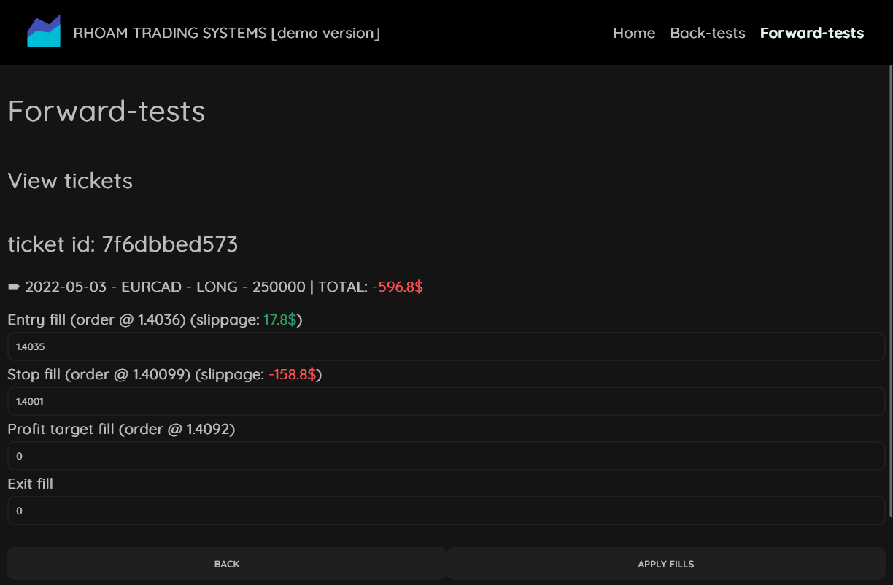
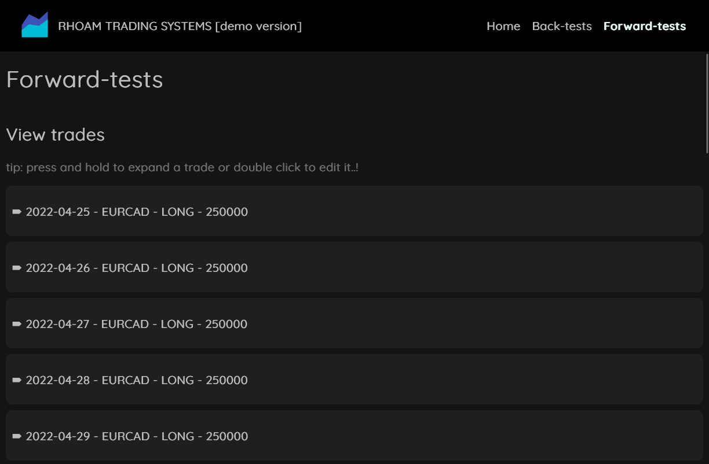
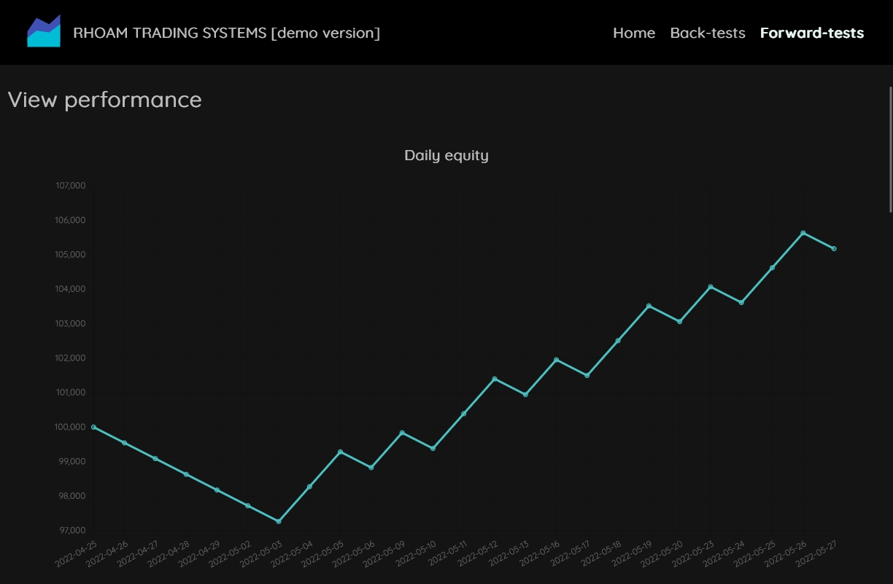
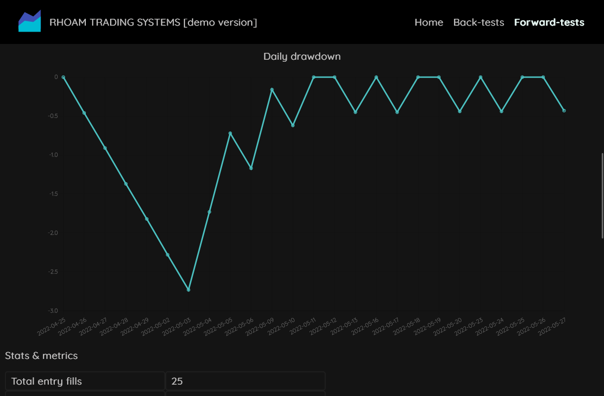
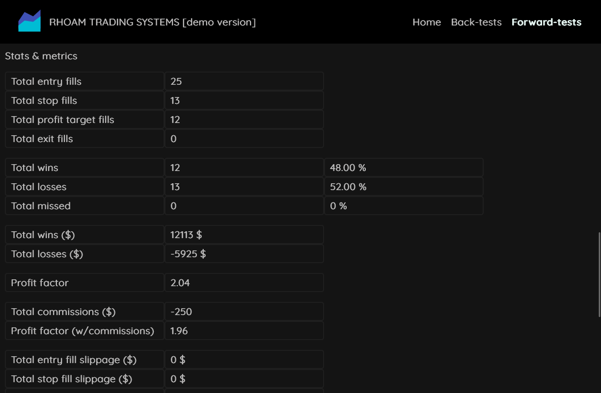

# Rhoam Trading Systems

This is an app for traders.
A trader can back-test and forward-test a trading system.

Read more on my take on why back-testing and forward-testing a trading system should be part of a single common app.
<https://christoskipouros.vercel.app/rhoam-trading-platform.pdf>

## About the app

A user can back-test and forward-test a trading system.

### Back-testing

Currently under development.

### Forward-testing

A user can use the wizard to create **tickets**. Tickets are trades that have not been filled (executed) yet, much like orders.

Once a ticket has been filled, a user can input the fills. The app will add the nesecery calculations (slippages, costs etc..) and the ticket will be saved as a **trade**.

Trades are finally analyzed and a performance summary of the trading system is generated. (equity and drawdown charts as well as many stats and metrics)

### Merging back and forward testing

The app will be able to merge results from back-testing and forward-testing, and provide valuable insight on adjusting parameters to secure a more accurate image of the trading system.
